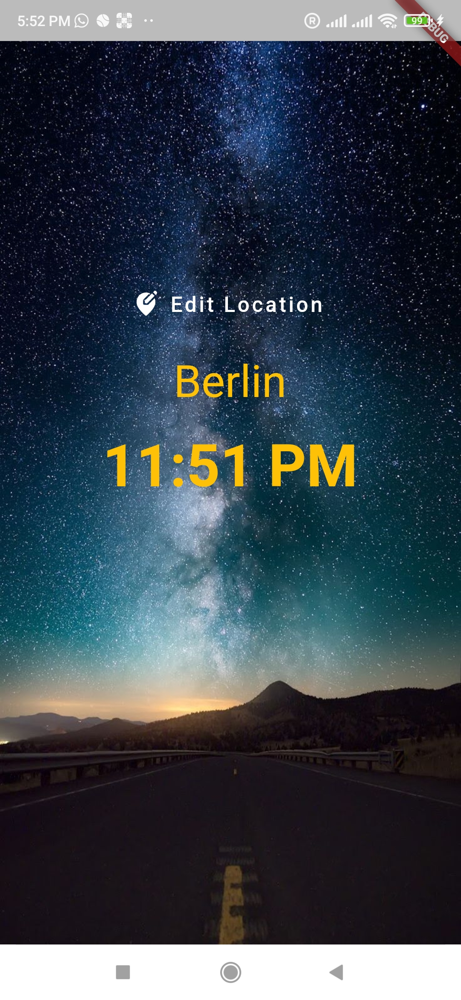

# WorldTimeAapp

Flutter based application that uses API to show current time of selected countries.


## Features

- Shows current time of selected country.
- Several options of countries represented with their flags.
- Dynamic background with Day/Night time.


## Dependencies

- http: 0.12.2
- intl: 0.16.1
- flutter_spinkit: 4.1.2+1
- cupertino_icons: 1.0.0
## Deployment

To deploy this project download this folder and run 

```bash
  main.dart   // First install all neccessary dependencies listed above or in pubspec file.
```


## Demo

Demo Video:

https://drive.google.com/file/d/1oAOQTsf4vHH1VdulSjLxLW05x_JvqxVg/view?usp=sharing

## Screenshots

<!-- ##  -->



<!--  -->


## Lessons Learned

Learned how to work with async data coming form API and how to present it dynamically.
## Authors

- [@DhruvDholakia](https://www.github.com/DhruvDholakiaCE)

